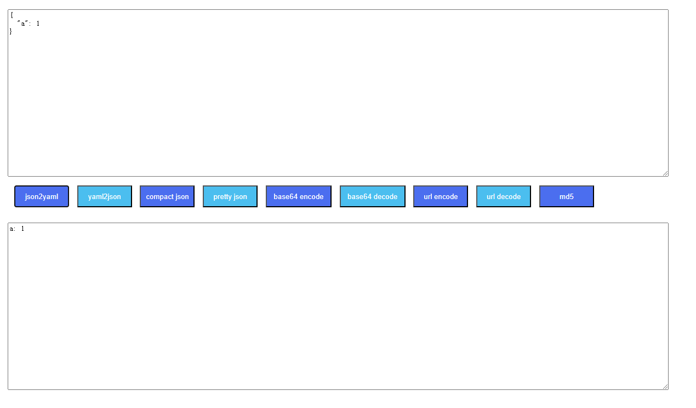

# kuligo
Kuligo is a little data format tools, e.x yaml to json, json to yaml, json to string, url encode, url decode, base64 encode and base64 decode and so on

# Start

## Run in docker

```shell script
docker build -t kuligo:1.0.0 .
docker run kuligo:1.0.0
```

